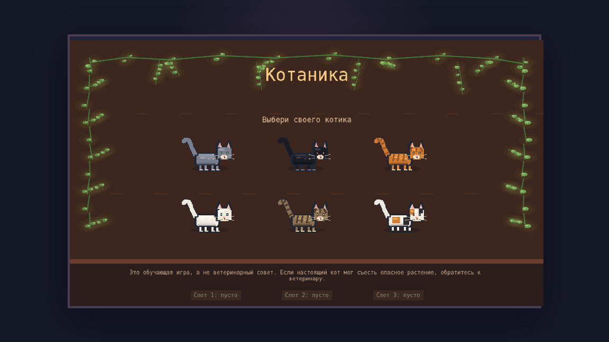
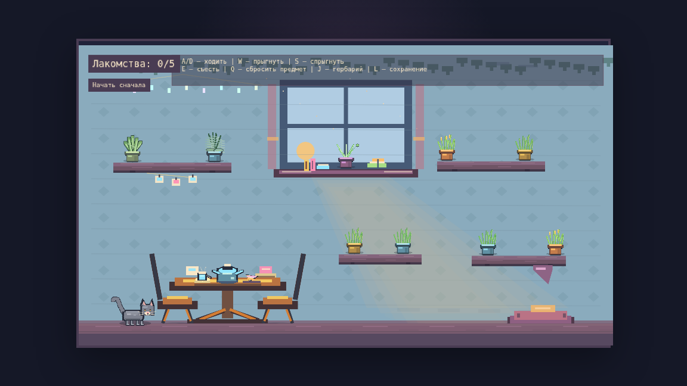
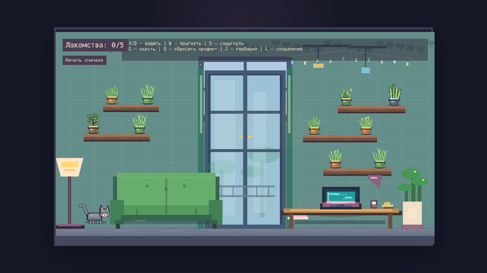
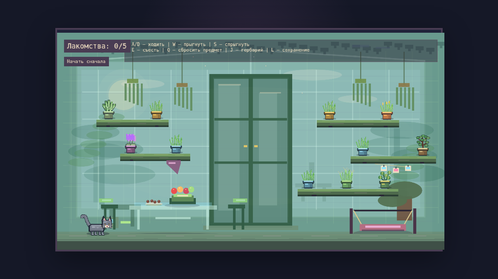

# Catanica / Котаника

**Catanica** is a cozy pixel-art educational platformer about a cat, houseplants, and the important bedtime work of collecting five treats before sleep.

The player controls a cat directly: walking across shelves and furniture, reading nearby plant labels, eating cat-friendly grass, and knocking risky pots out of reach. The game is intentionally small, warm, and demo-friendly: it is meant to show an end-to-end AI-native development workflow rather than become a production game.

> Educational disclaimer: this game is not veterinary advice. If a real cat may have eaten a harmful or questionable plant, contact a veterinarian or animal poison control.

## Project Overview

This project was built for an internal AI-native development challenge. The goal was to practice working with Codex as a development partner across planning, implementation, testing, visual iteration, documentation, and delivery.

The current version includes:

- six playable rooms: kitchen, remote office, living room, bedroom, greenhouse, and grandma corner;
- six selectable cat coats with generated eye colors;
- a curated local plant database with edible, neutral, and dangerous plant categories;
- seed-based shelf generation with layout validation;
- local save slots;
- plant journal / herbarium view;
- room-specific music, Web Audio sound effects, and a short defeat mp3 sample;
- generated PNG pixel-art assets for cats, plants, and some decor;
- automated unit, build, and visual smoke checks.

## Play Online

[Play Catanica / Котаника](https://trishame.github.io/catanica/)

## Game Description

Each level is a room full of shelves, furniture, and houseplants. The cat needs to collect enough safe treats before bedtime.

Plant actions:

- **Edible / cat plant**: eat it to gain one treat.
- **Neutral plant**: eating or knocking it does not reward the player, but the cat is fine.
- **Dangerous plant**: knock it down to remove the hazard; eating it causes a loss.

The level ends when the cat collects **5 treats** or when all plants are gone. If the cat eats a dangerous plant, the failure line appears:

~~~text
Вы прокляты Азурой за невнимательность
~~~

The cat is never shown as harmed; the loss state is dramatic and educational, not graphic.

## Screenshots

### Start Screen

### Kitchen

### Remote Office

### Greenhouse

## Setup Instructions

Requirements:

- Node.js 20+ recommended;
- npm;
- Google Chrome or Chromium for visual smoke tests. The script uses /usr/bin/google-chrome by default. Set CHROME_BIN if Chrome lives elsewhere.

Install dependencies:

~~~bash
npm install
~~~

## Run Instructions

Start the local development server:

~~~bash
npm run dev
~~~

Then open the local URL printed by Vite, usually:

~~~text
http://127.0.0.1:5173/
~~~

Preview a production build locally:

~~~bash
npm run build
npm run preview
~~~

Vite preview usually opens on:

~~~text
http://127.0.0.1:4173/
~~~

## Controls

| Input | Action |
| --- | --- |
| A / D or arrow keys | Walk |
| W | Jump |
| S or down arrow | Drop through a shelf |
| E | Eat nearby plant |
| Q | Knock nearby object / pot |
| J | Open herbarium |
| L | Open save slots |
| R | Restart / return to main menu when prompted |
| Caps Lock | Secret giant-cat joke mode |

## Test Instructions

Run all unit tests:

~~~bash
npm run test
~~~

Run a production build:

~~~bash
npm run build
~~~

Run visual smoke tests:

~~~bash
npm run visual:smoke
~~~

Run the full local verification suite:

~~~bash
npm run check
~~~

Current verification includes:

- unit tests for plant rules, level generation, saves, journal, stats, audio cue contracts, and assets;
- TypeScript production build;
- headless Chrome screenshots for the start screen and all six rooms.

## GitLab Pages Deployment

The repository includes a GitLab Pages pipeline in .gitlab-ci.yml. It expects a project runner tagged catanica-local. If your runner uses another tag, update the default tags block in .gitlab-ci.yml before pushing.

The pipeline runs unit tests and a production build, then publishes the Vite dist/ directory with GitLab Pages. After the first successful default-branch pipeline, copy the Pages URL from GitLab into this README as the playable demo link.

Note: npm run check is intentionally kept as a local verification command because the visual smoke step needs Chrome. The CI pipeline uses npm run test and npm run build so it can run in a simple node:20 container.

## Repository Documents

- [SPEC.md](SPEC.md) - game rules, scope, requirements, and acceptance criteria.
- [ARCHITECTURE.md](ARCHITECTURE.md) - stack, architecture, design decisions, and AI workflow.
- [RETROSPECTIVE.md](RETROSPECTIVE.md) - AI-native workflow lessons learned.
- [docs/ai-tools-and-issues.md](docs/ai-tools-and-issues.md) - detailed tool and issue log captured during development.
- [docs/roadmap.md](docs/roadmap.md) - future improvement ideas.
- [docs/pixel-art-asset-plan.md](docs/pixel-art-asset-plan.md) - plan for replacing generated art with real sprite assets.

## Plant Data Note

The game uses a curated local plant database instead of fetching plant data at runtime. This keeps the demo deterministic, testable, and easy to run without network access.

Initial references:

- [ASPCA Toxic and Non-Toxic Plant List - Cats](https://www.aspca.org/pet-care/animal-poison-control/cats-plant-list)
- [Pet Poison Helpline - Lilies](https://www.petpoisonhelpline.com/poison/lilies/)
